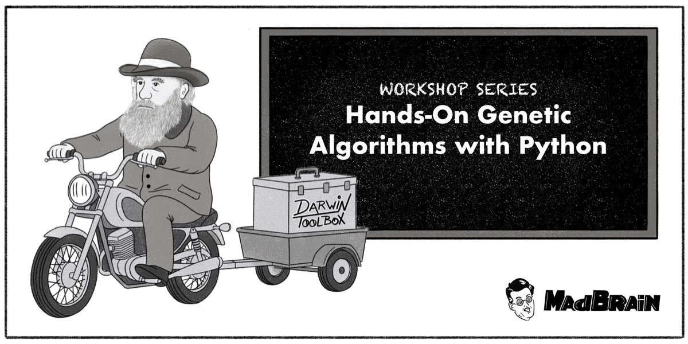

# 🧬 Genetic Algorithms Workshop

**by [MadBrain Labs](https://madbrain.ai)**

> Learn how evolution inspires algorithms — from natural selection to optimization with Python.

---

## 📘 Overview

Welcome to the **Genetic Algorithms Workshop** — a hands-on coding series where you’ll build, visualize, and understand **evolutionary algorithms** step by step using Python and the [DEAP](https://deap.readthedocs.io) framework.

This repository contains:

- 🧩 Interactive **exercises** (`.ipynb`) with guided `### TODO` sections.
- ✅ Full **solutions** for each problem.
- 🖼️ The **PDF presentation** used during the workshop.
- 🔗 Links to open each notebook directly in **Google Colab**.

📖 Read the full accompanying article here:
👉 [Hands-On Genetic Algorithms with Python](https://madbrain.ai/hands-on-genetic-algorithms-with-python-775b7c502957)

---

## 🧠 What You’ll Learn

- The intuition behind **Genetic Algorithms** (GAs) — inspired by Darwin’s theory of evolution.
- How to represent, mutate, and evolve digital organisms.
- Step-by-step GA workflow:

  1. Population initialization
  2. Fitness evaluation
  3. Selection, crossover, mutation
  4. Statistics and visualization

- Applying GAs to solve problems like:

  - 🎯 **OneMax Problem** — evolve the perfect binary string.
  - 🎒 **Knapsack Problem** — maximize value under constraints.
  - 👩‍⚕️ **Nurse Scheduling Problem** — handle hard and soft constraints.

---

## 📂 Repository Structure

```
Genetic-Algorithms-Workshop/
│
├── 📄 README.md                 ← You are here
├── 🧾 slides.pdf                ← Full presentation
│
├── notebooks/
│   ├── 01_one_max_exercise.ipynb
│   ├── 01_one_max_solution.ipynb
│   ├── 02_knapsack_exercise.ipynb
│   ├── 02_knapsack_solution.ipynb
│   ├── 03_nurse_scheduling_exercise.ipynb
│   ├── 03_nurse_scheduling_solution.ipynb
```

---

## 🚀 Run the Workshop in Google Colab

You can open each exercise directly in Colab — no installation required!

| Notebook            | Exercise                                                                                   | Solution                                                                                               |
| ------------------- | ------------------------------------------------------------------------------------------ | ------------------------------------------------------------------------------------------------------ |
| 🧩 OneMax           | [Open in Colab](https://colab.research.google.com/drive/1It7FSMN5MBIEQixtFxPmBckOat7Heqy7) | [View Solution](https://colab.research.google.com/drive/1t8NLpHbsuBZ05NhLv_ZI8YJOQvua48-T)             |
| 🎒 Knapsack         | [Open in Colab](https://colab.research.google.com/drive/19FPz5YD21-5v8w7D9l2eoVFS0CtRVrJL) | [View Solution](https://colab.research.google.com/drive/1YbCy_Kf0RJFv5cuyolFZhANNFzwhAk-e?usp=sharing) |
| 👩‍⚕️ Nurse Scheduling | [Open in Colab](https://colab.research.google.com/drive/1I4jNcigzjT9yrhjH4FxQVw8a89LDFELY) | [View Solution](https://colab.research.google.com/drive/1Ai7sIh_zonpCLk6r_LFU8EISI41IJhU6?)            |

---

## 🧰 Requirements

To run locally:

```bash
pip install deap matplotlib seaborn numpy jupyter
```

Then launch Jupyter Notebook:

```bash
jupyter notebook notebooks/
```

Start with:

```
01_one_max_exercise.ipynb
```

---

## 🖼️ Presentation

📑 Download the **PDF slides**:
[➡️ slides.pdf](./slides.pdf)

The slides cover:

- The story of Darwin and the finches 🐦
- How evolution translates into computation
- Key GA components (population, fitness, mutation)
- Demo visuals and diagrams

---

## 🎓 Workshop Outline

| Part | Topic                 | Description                                                 |
| ---- | --------------------- | ----------------------------------------------------------- |
| 🧩 1 | **OneMax Problem**    | Introduction to genetic representation and basic operators. |
| 🎒 2 | **Knapsack Problem**  | Combining value optimization with constraints.              |
| 👩‍⚕️ 3 | **Nurse Scheduling**  | Handling hard and soft constraints using GA.                |
| 🧬 4 | **Advanced Concepts** | Elitism, niching, and tuning evolutionary parameters.       |

---

## 🧠 Read More

> **Article:** [Hands-On Genetic Algorithms with Python](https://madbrain.ai/hands-on-genetic-algorithms-with-python-775b7c502957)
> Learn the theory behind this workshop — how nature’s principles can guide machine intelligence.

---

## 🤝 Contributing

Contributions and improvements are welcome!
Feel free to open an issue or submit a pull request.

---

## 🧬 About MadBrain Labs

MadBrain Labs is building **brain-inspired AI for humanoid robots** — merging neuroscience, robotics, and machine learning.
Learn more at [madbrain.ai](https://madbrain.ai)
